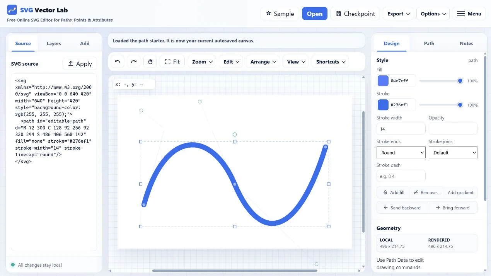

# SVG Vector Lab

A zero-dependency, in-browser SVG editor. Load real SVG markup and edit the actual elements — paths, shapes, attributes, transforms, and individual path points — with the source, layer list, and inspector staying in sync the whole time.

**Live site:** [svgvectorlab.com](https://svgvectorlab.com/)



## Getting started

Open `public/index.html` in a browser. That's it — no build step and no dependencies. (Serving the `public` folder with any static file server also works.)

Your work is autosaved to the browser's `localStorage` and restored on the next visit. Click **Sample** to start fresh.

## Features

- **Live source panel** — the SVG markup updates as you edit, and you can paste/edit markup directly and hit Load.
- **Selection** — click to select, Shift/Ctrl+click for multi-select, drag on empty canvas for rubber-band selection, Escape to deselect. Selection survives undo/redo.
- **Direct manipulation** — drag elements (multi-selection moves together), drag path endpoints and Bézier control points, resize with the 8 bounding-box handles (Shift = uniform), rotate with the handle above the box (Shift = 15° steps). All of it is transform-aware, so elements inside transformed `<g>` groups behave correctly.
- **Snap** — dragged path points snap to other elements' corners, centers, and vertices, computed in screen space so it works across transformed elements.
- **Inspector** — fill/stroke with alpha, stroke width, opacity, per-shape geometry fields, text content editing, a raw attribute editor, and a path command table.
- **Convert to path** — turns rects, circles, ellipses, lines, polygons, and polylines into editable `<path>` commands.
- **Import** — Open button, drag-and-drop an `.svg` file onto the canvas, or paste SVG markup anywhere outside a text field. Input is sanitized (scripts, event handlers, and `javascript:` URLs are stripped).
- **Export** — copy the cleaned markup, download as SVG, or render to PNG at 1–8× scale with an optional background color.
- **Canvas** — zoom presets, Ctrl/Cmd+wheel zooms toward the cursor, Space-drag or middle-mouse pans, Fit sizes the drawing to the viewport.

## Keyboard shortcuts

| Shortcut | Action |
| --- | --- |
| Ctrl/Cmd+Z · Ctrl/Cmd+Shift+Z or Ctrl/Cmd+Y | Undo · Redo (canvas edits; text fields keep native undo) |
| Ctrl/Cmd+D | Duplicate selection |
| Delete / Backspace | Delete selection |
| Arrow keys | Nudge selection (or the active path point) by 1 unit |
| Shift+Arrows / Alt+Arrows | Nudge by 10 / 0.1 units |
| Escape | Clear selection |
| Space+drag | Pan the canvas |
| Ctrl/Cmd+wheel | Zoom toward the cursor |
| Shift+click / Shift+drag | Add to selection / additive rubber-band |

## Site content

Alongside the editor, the project includes About, Privacy, Terms, Contact, and SVG guide pages. Every indexable route has a unique title, description, canonical URL, Open Graph metadata, internal navigation, and appropriate structured data. The sitemap contains all public routes.

Content routes use the small `content.css` bundle and no production page JavaScript. A tiny shared-layout script remains in the HTML only as a direct-file/static-host fallback; the Cloudflare Worker removes it after composing the header and footer.

## Deploying / SEO

The production origin is `https://svgvectorlab.com`. Canonical URLs, social metadata, structured data, `robots.txt`, and `sitemap.xml` all use that origin.

Cloudflare publishes only the `public/` directory. Repository metadata, tests, documentation, and Wrangler configuration stay outside the web root. The static `_headers` file sets browser protections, while `src/worker.mjs` adds a fresh script nonce and Content Security Policy to every HTML response so AdSense can run under Google's supported strict-CSP model. Vulnerability reporting details are published at `/.well-known/security.txt`; refresh its `Expires` field before it becomes stale.

For Cloudflare Workers Builds, connect the GitHub repository once and use Git-integrated deployments. The included `wrangler.jsonc` points to the Worker and the `public/` asset directory, and disables public `workers.dev` and preview URLs so the custom domain remains the only production address. Future pushes deploy automatically; no local deploy command is required.

Cloudflare Web Analytics can be enabled from the project's Metrics screen. Cloudflare injects the analytics beacon on the next deployment, so no analytics token or script needs to be committed. The Privacy Policy already includes the corresponding disclosure.

The editor loads the AdSense library once and lazy-initializes one responsive unit in each tab. The production `ads.txt` contains the authorized publisher record. Keep it synchronized with AdSense and confirm it remains available at `https://svgvectorlab.com/ads.txt`.

GitHub Actions runs the complete Node test suite and checks the Worker syntax on every push and pull request.

## Project structure

```
public/                 Only files published to the web
  index.html            App shell, panels, metadata, and ads
  partials/             Shared header/footer, with Worker composition and a static-host fallback
  styles.css            Editor and shared layout styling
  content.css           Lightweight styling for articles and landing pages
  js/                   Editor, sanitizer, icons, path data, ad initialization
  about/                Project background and product principles
  free-svg-editor/      Editor features and overview page
  edit-svg-online/      General online SVG editing landing page
  svg-path-editor/      Point and Bézier path editing landing page
  convert-shapes-to-paths/  Shape-to-path conversion landing page
  svg-to-png/           SVG-to-PNG export landing page
  guides/               SVG tutorial hub and in-depth guides, including viewBox, paths, curves, conversion, and optimization
  privacy/              Privacy and advertising disclosure
  terms/                Terms of use
  contact/              Public support and contact channels
  docs/                 Social-sharing and screenshot images
  404.html              Custom not-found page
  _headers              Static-host security headers
  ads.txt               AdSense publisher authorization
  robots.txt            Crawler policy + sitemap pointer
  sitemap.xml           Sitemap for every public route
  llms.txt               Concise machine-readable site and content map
  auth.md                Anonymous agent-access and credential guidance
  .well-known/           Agent Skills discovery index and skill artifact
  .assetsignore         Defense-in-depth exclusions for accidental secrets
src/worker.mjs          Security/discovery headers, Markdown negotiation, and static assets
tests/                  Node unit, content, ad, and deployment-boundary tests
scripts/                Optional maintenance tools for favicons, IndexNow, and live security checks
.github/workflows/      Push and pull-request test automation
wrangler.jsonc          Cloudflare Worker and asset configuration
SECURITY.md             Private reporting and deployment-boundary policy
LAUNCH_CHECKLIST.md     Domain, hosting, search, policy, and AdSense handoff
```

The scripts are plain (non-module) files loaded in order so the app keeps working when opened via `file://`, where ES modules are blocked.

## Tests

Run the full suite locally with:

```
node --test tests/*.test.mjs
```

After a production deployment, verify that public files work, private repository paths return 404, and security headers are present:

```
node scripts/check-live-security.mjs
```

## License

[MIT](LICENSE)
