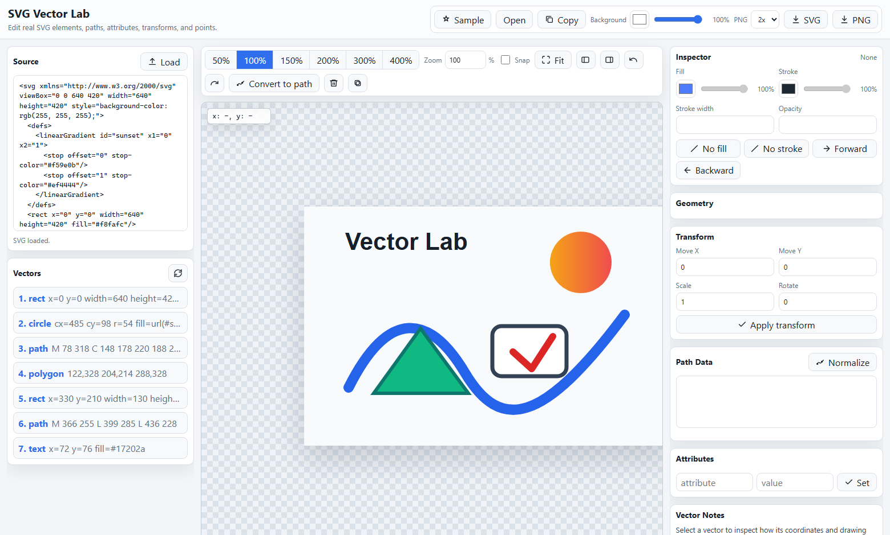

# SVG Vector Lab

A zero-dependency, in-browser SVG editor. Load real SVG markup and edit the actual elements — paths, shapes, attributes, transforms, and individual path points — with the source, layer list, and inspector staying in sync the whole time.



## Getting started

Open `index.html` in a browser. That's it — no build step, no server, no dependencies. (Serving the folder with any static file server also works.)

Your work is autosaved to the browser's `localStorage` and restored on the next visit. Click **Sample** to start fresh.

## Features

- **Live source panel** — the SVG markup updates as you edit, and you can paste/edit markup directly and hit Load.
- **Selection** — click to select, Shift/Ctrl+click for multi-select, drag on empty canvas for rubber-band selection, Escape to deselect. Selection survives undo/redo.
- **Direct manipulation** — drag elements (multi-selection moves together), drag path endpoints and Bézier control points, resize with the 8 bounding-box handles (Shift = uniform), rotate with the handle above the box (Shift = 15° steps). All of it is transform-aware, so elements inside transformed `<g>` groups behave correctly.
- **Snap** — dragged path points snap to other elements' corners, centers, and vertices, computed in screen space so it works across transformed elements.
- **Inspector** — fill/stroke with alpha, stroke width, opacity, per-shape geometry fields, text content editing, a raw attribute editor, and a path command table.
- **Convert to path** — turns rects, circles, ellipses, lines, polygons, and polylines into editable `<path>` commands.
- **Import** — Open button, drag-and-drop an `.svg` file onto the canvas, or paste SVG markup anywhere outside a text field. Input is sanitized (scripts, event handlers, and `javascript:` URLs are stripped).
- **Export** — copy the cleaned markup, download as SVG, or render to PNG at 1–8× scale with an optional background color.
- **Canvas** — zoom presets, Ctrl/Cmd+wheel zooms toward the cursor, Space-drag or middle-mouse pans, Fit sizes the drawing to the viewport.

## Keyboard shortcuts

| Shortcut | Action |
| --- | --- |
| Ctrl/Cmd+Z · Ctrl/Cmd+Shift+Z or Ctrl/Cmd+Y | Undo · Redo (canvas edits; text fields keep native undo) |
| Ctrl/Cmd+D | Duplicate selection |
| Delete / Backspace | Delete selection |
| Arrow keys | Nudge selection (or the active path point) by 1 unit |
| Shift+Arrows / Alt+Arrows | Nudge by 10 / 0.1 units |
| Escape | Clear selection |
| Space+drag | Pan the canvas |
| Ctrl/Cmd+wheel | Zoom toward the cursor |
| Shift+click / Shift+drag | Add to selection / additive rubber-band |

## Site content

Alongside the editor, the project includes About, Privacy, Terms, Contact, and SVG guide pages. Every indexable route has a unique title, description, canonical URL, Open Graph metadata, internal navigation, and appropriate structured data. The sitemap contains all public routes.

## Deploying / SEO

The production origin is `https://svgvectorlab.com`. Canonical URLs, social metadata, structured data, `robots.txt`, and `sitemap.xml` all use that origin.

The repository includes `_headers` for Cloudflare Pages. It configures conservative security headers without changing editor behavior.

For Cloudflare Pages, connect the GitHub repository once and use Git-integrated deployments. Set `main` as production, use `exit 0` as the dashboard build command, and select the repository root as the output directory. Future pushes deploy automatically.

Cloudflare Web Analytics can be enabled from the Pages project's Metrics screen. Pages injects the analytics beacon on the next deployment, so no analytics token or script needs to be committed. The Privacy Policy already includes the corresponding disclosure.

After AdSense approval, copy `ads.txt.example` to `ads.txt`, replace the sample publisher ID with the exact value supplied by AdSense, and confirm the file is available at `https://svgvectorlab.com/ads.txt`. Do not publish the sample publisher ID.

## Project structure

```
index.html            App shell, panels, SEO metadata, crawlable footer
styles.css            All styling
js/path-data.js       Pure path-data parsing/serialization (browser + Node)
js/svg-utils.js       Sanitizing, sizing, color, and shape-conversion helpers
js/icons.js           Inline icon set and button decoration
js/app.js             State, selection, drag interactions, inspector, history, IO
tests/                Node test suite for the path-data module
favicon.svg           App icon (also used by the web manifest)
site.webmanifest      PWA/installability manifest
robots.txt            Crawler policy + sitemap pointer
sitemap.xml           Sitemap for every public route
about/                Project background and product principles
guides/               SVG tutorial hub and in-depth guides
privacy/              Advertising-ready privacy disclosure
terms/                Terms of use
contact/              Public support and contact channels
404.html              Custom not-found page
_headers              Static-host security headers
ads.txt.example       AdSense ads.txt template (not active)
docs/og-card.png       Social-sharing image
LAUNCH_CHECKLIST.md    Domain, hosting, search, policy, and AdSense handoff
```

The scripts are plain (non-module) files loaded in order so the app keeps working when opened via `file://`, where ES modules are blocked.

## Tests

The path-data module (path parsing including compact arc flags, serialization, translation, point extraction, handle building) is covered by unit tests:

```
node --test tests/path-data.test.mjs
```

## License

[MIT](LICENSE)
